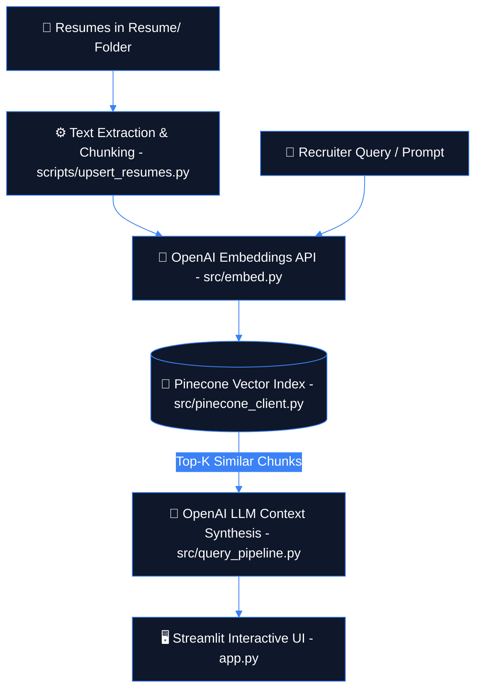

<!-- palette: #0F172A, #3B82F6 | theme: RAG Architecture & Vector Intelligence -->

<div align="center">


<a href="https://readme-typing-svg.demolab.com">
  
</a>

<p align="center">
  <b>Resume Retrieval-Augmented Generation (RAG) system with AI classification and semantic search.</b>
</p>

<p align="center">
  <a href="https://github.com/Shikhar-Kesharwani/TalentForge/graphs/contributors"></a>
  <a href="https://github.com/Shikhar-Kesharwani/TalentForge/network/members"></a>
  <a href="https://github.com/Shikhar-Kesharwani/TalentForge/stargazers"></a>
  <a href="https://github.com/Shikhar-Kesharwani/TalentForge/issues"></a>
  <a href="https://github.com/Shikhar-Kesharwani/TalentForge/blob/main/LICENSE"></a>
</p>

---

</div>

## 📑 Table of Contents

- [🎯 Overview](#-overview)
- [✨ Key Features](#-key-features)
- [🖼️ Architecture Framework](#️-architecture-framework)
- [💻 Tech Stack](#-tech-stack)
- [🏗️ RAG Pipeline Workflow](#️-rag-pipeline-workflow)
- [🚀 Getting Started](#-getting-started)
  - [📋 Prerequisites](#-prerequisites)
  - [⚙️ Installation](#️-installation)
  - [🔑 Environment Variables](#-environment-variables)
- [📖 Usage](#-usage)
- [📁 Project Structure](#-project-structure)
- [🧪 Testing](#-testing)
- [🗺️ Roadmap](#️-roadmap)
- [🤝 Contributing](#-contributing)
- [📄 License](#-license)
- [📬 Contact & Support](#-contact--support)

---

## 🎯 Overview

**TalentForge** is an AI-powered Resume Retrieval-Augmented Generation (RAG) platform designed to query, analyze, and classify candidate resumes using vector embeddings and Large Language Models. 

Instead of relying on basic keyword matching, TalentForge converts unstructured candidate documents into high-dimensional vector embeddings stored in a Pinecone vector index. Recruiters can query candidate repositories in natural language, retrieve contextually relevant resume chunks, and receive AI-generated candidate evaluations and skill summaries in real time.

> **Key Takeaway:** Combines **Pinecone Vector Search** + **OpenAI LLM Reasoning** + **Streamlit UI** to deliver accurate, context-aware candidate retrieval.

---

## ✨ Key Features

### 🔍 Semantic Resume Search & Q&A
* Natural language querying across candidate CV databases (e.g., *"Find candidates with 3+ years in PyTorch and AWS"*).
* Vector similarity retrieval powered by OpenAI embeddings and Pinecone Indexing.

### 🤖 AI Candidate Classification & Scoring
* Automatic skill extraction and competency categorization across 24 predefined domain categories.
* Generates contextual candidate summaries based on retrieved resume chunks.

### 📄 Multi-Document Processing Pipeline
* Ingests and processes candidate resumes from the `Resume/` directory using `scripts/upsert_resumes.py`.
* Automated text chunking, tokenization, and embedding generation.

### 🖥️ Interactive Web Dashboard
* Clean Streamlit interface (`app.py`) for entering queries, viewing matches, and inspecting processing traces.

---

## 🖼️ Architecture Framework

<div align="center">


*Figure 1: High-Level TalentForge RAG Architecture & Ingestion Flow*

</div>

---

## 💻 Tech Stack

<div align="center">

### Core Language & Framework
[](https://www.python.org/)
[](https://streamlit.io/)

### Vector Database & AI Services
[](https://www.pinecone.io/)
[](https://openai.com/)

### Document Parsing & Vector Utilities
[](https://pandas.pydata.org/)
[](https://docs.pydantic.dev/)

</div>

---

## 🏗️ RAG Pipeline Workflow



---

## 🚀 Getting Started

### 📋 Prerequisites

Verify that your local system has the following requirements:

* **Python**: `v3.10` or higher
* **pip**: `v22.0` or higher
* **OpenAI API Key**: [Get key from OpenAI](https://platform.openai.com/)
* **Pinecone API Key & Index**: [Get key from Pinecone](https://www.pinecone.io/)

### ⚙️ Installation

1. **Clone the Repository**
   ```bash
   git clone https://github.com/Shikhar-Kesharwani/TalentForge.git
   cd TalentForge
   ```

2. **Create and Activate Virtual Environment**
   ```bash
   # On macOS/Linux:
   python3 -m venv venv
   source venv/bin/activate

   # On Windows:
   python -m venv venv
   venv\Scripts\activate
   ```

3. **Install Dependencies**
   ```bash
   pip install -r requirements.txt
   ```

4. **Configure Environment Variables**
   Create a `.env` file in the root directory:
   ```env
   OPENAI_API_KEY=sk-proj-xxxxxxxxxxxx
   PINECONE_API_KEY=pcsk_xxxxxxxxxxxx
   PINECONE_INDEX=resumes-index
   PINECONE_CLOUD=aws
   PINECONE_REGION=us-east-1
   ```

5. **Run Resume Ingestion & Vector Embedding**
   ```bash
   python scripts/upsert_resumes.py --csv Resume/Resume_cleaned.csv
   ```

6. **Launch the Application**
   ```bash
   streamlit run app.py
   ```

### 🔑 Environment Variables

| Variable Name | Description | Required | Example |
| :--- | :--- | :---: | :--- |
| `OPENAI_API_KEY` | Secret API key for OpenAI text embeddings and LLM | Yes | `sk-proj-xxxxxxxxxxxx` |
| `PINECONE_API_KEY` | Secret API key for Pinecone vector store | Yes | `pcsk_xxxxxxxxxxxx` |
| `PINECONE_INDEX` | Name of your target Pinecone vector index | Yes | `resumes-index` |
| `PINECONE_CLOUD` | Cloud provider hosting Pinecone index | No | `aws` |
| `PINECONE_REGION` | Pinecone deployment region | No | `us-east-1` |

---

## 📖 Usage

### Running Ingestion & Web App

1. Place candidate resume CSV/documents inside the `Resume/` folder.
2. Run the script to generate embeddings and populate Pinecone index:
   ```bash
   python scripts/upsert_resumes.py --csv Resume/Resume_cleaned.csv
   ```
3. Start the Streamlit user interface:
   ```bash
   streamlit run app.py
   ```
4. Ask natural language questions like:
   * *"Which candidates have experience with Docker and Kubernetes?"*
   * *"Summarize top candidates for a Senior Data Scientist role."*

---

## 📁 Project Structure

```
TalentForge/
├── 📄 app.py                  # Main Streamlit web application entrypoint
├── 📄 framework.png           # Architecture diagram asset
├── 📁 Resume/                 # Storage folder for candidate resumes
├── 📁 scripts/                # Utility scripts for data processing & ingestion
│   └── 📄 upsert_resumes.py   # Embeddings generation and Pinecone upload
├── 📁 src/                    # Core RAG pipeline modules
│   ├── 📄 config.py           # API keys and environment configuration
│   ├── 📄 embed.py            # OpenAI embedding generation
│   ├── 📄 llm.py              # LLM prompt templates and text generation
│   ├── 📄 pinecone_client.py  # Pinecone index management & query execution
│   ├── 📄 query_pipeline.py   # End-to-end RAG query workflow
│   └── 📄 tools.py            # Helper tools & formatters
├── 📄 requirements.txt        # Python package dependencies
├── 📄 .gitignore              # Files ignored by version control
└── 📄 README.md               # Repository documentation
```

---

## 🧪 Testing

Run unit tests and verify RAG query connections:

```bash
# Execute test scripts
pytest tests/ -v
```

---

## 🗺️ Roadmap

- [x] Pinecone vector database integration & document chunking
- [x] Streamlit web UI with live query interface
- [x] OpenAI RAG retrieval pipeline
- [ ] Multi-file drag-and-drop ingestion directly in Streamlit UI
- [ ] Hybrid BM25 + Dense vector retrieval strategy
- [ ] Automated candidate score summary export (PDF/CSV)

---

## 🤝 Contributing

Contributions are welcome! Please follow these steps:

1. Fork the Repository.
2. Create your Feature Branch (`git checkout -b feature/AmazingFeature`).
3. Commit your Changes (`git commit -m 'Add AmazingFeature'`).
4. Push to the Branch (`git push origin feature/AmazingFeature`).
5. Open a Pull Request.

---

## 📄 License

Distributed under the **MIT License**. See `LICENSE` for details.

---

## 📬 Contact & Support

* **Maintainer**: Shikhar Kesharwani - [@Shikhar-Kesharwani](https://github.com/Shikhar-Kesharwani)
* **GitHub Repository**: [Shikhar-Kesharwani/TalentForge](https://github.com/Shikhar-Kesharwani/TalentForge)

<div align="center">


<p><sub>Built with care for recruiters and data teams worldwide • Star this repo if you find it helpful! 🌟</sub></p>

</div>
